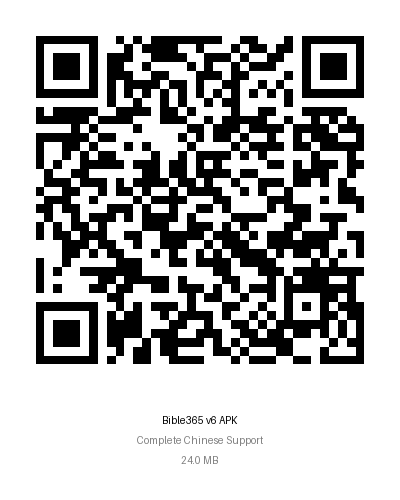

# Bible365 APKs

This repository contains the Android APK files for the Bible365 app - a daily Bible reading companion that helps you read through the Bible in a year.

## 📱 App Description

Bible365 is a Flutter-based mobile application that provides:
- Daily Bible reading plans
- SOAP journaling functionality
- Reading streak tracking
- Multiple Bible translations
- Offline scripture storage
- Daily notifications

## 📦 Available APKs

### Release APK (Recommended)
- **File**: `bible365-v6-release.apk`
- **Version**: v6.0
- **Size**: ~24.0 MB
- **Type**: Production build
- **Features**: Complete Chinese language support across all screens
- **Optimized**: Yes, for performance and size
- **Use**: Install on your Android device for the best experience

### Previous Version
- **File**: `bible365-v5-release.apk`
- **Version**: v5.0
- **Size**: ~23.9 MB
- **Type**: Production build
- **Features**: Partial Chinese language support

### Previous Version
- **File**: `bible365-v4-release.apk`
- **Version**: v4.0
- **Size**: ~23.2 MB
- **Type**: Production build
- **Features**: English only

### Debug APK
- **File**: `bible365-v4-debug.apk`
- **Version**: v4.0
- **Size**: ~80.2 MB
- **Type**: Debug build
- **Optimized**: No, contains debug information
- **Use**: For development and testing purposes

## 📱 Quick Download

### QR Code Download
Scan this QR code with your Android device to quickly access the APK download:

**Direct Download Link**: [bible365-v6-release.apk](https://github.com/vincenthanjs/bible365-apks/blob/main/bible365-v6-release.apk)

## 🚀 Installation Instructions

1. **Download** the `bible365-v6-release.apk` file to your Android device
2. **Enable** "Install from Unknown Sources" in your device settings:
   - Go to Settings → Security → Install unknown apps
   - Enable for your file manager or browser
3. **Tap** the downloaded APK file to install
4. **Launch** the app and start your Bible reading journey!

## 📋 Requirements

- Android 5.0 (API level 21) or higher
- At least 50 MB of free storage space
- Internet connection for initial setup and Bible text downloads

## 🔧 Features

- **Daily Reading Plans**: Structured 365-day Bible reading schedule
- **SOAP Journaling**: Scripture, Observation, Application, Prayer format
- **Progress Tracking**: Visual progress indicators and streak counters
- **Multiple Translations**: Support for various Bible versions
- **Offline Access**: Download scriptures for offline reading
- **Notifications**: Daily reminders to maintain your reading habit

## 📱 Screenshots

*Screenshots will be added soon*

## 🐛 Bug Reports

If you encounter any issues, please report them in the main project repository: [bible365](https://github.com/vincenthanjs/bible365)

## 📄 License

This project is licensed under the MIT License - see the main project repository for details.

## 🔄 Updates

This repository will be updated with new APK releases as the app is developed and improved.

---

**Note**: This repository only contains the compiled APK files. For the source code and development, visit the main [bible365 repository](https://github.com/vincenthanjs/bible365).
